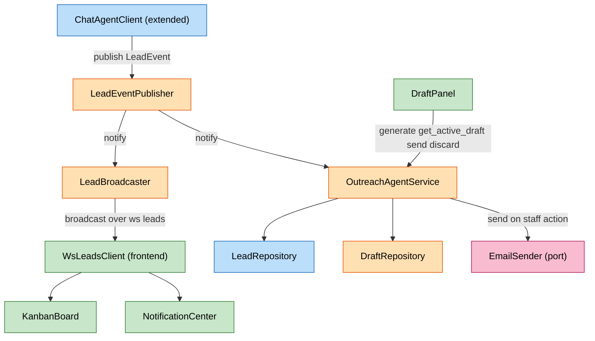

# Component Dependencies — BackOffice Lead Qualification View

**Date**: 2026-07-10

---

## Dependency Matrix

| Component | Depends On | Communication Pattern |
|---|---|---|
| `ChatAgentClient` (extended) | `LeadEventPublisher` | Direct in-process call (`publish`) after persisting a score change |
| `LeadEventPublisher` | — | In-memory pub/sub; no external dependency |
| `LeadBroadcaster` | `LeadEventPublisher`, `LeadQueryService` | Subscribes to publisher; calls `LeadQueryService.list_leads()` for reconnect snapshots |
| `OutreachAgentService` | `LeadEventPublisher`, `DraftRepository`, `LeadRepository`, `EmailSender` | Subscribes to publisher (auto trigger); direct calls to repositories/port |
| `LeadQueryService` | `LeadRepository` | Direct in-process call |
| `DraftRepository` | Postgres (new table) | SQL adapter, same pattern as `PostgresLeadRepository` |
| `EmailSender` | External email provider (TBD, NFR-5) | Port only — no adapter wired yet |
| `apps/backoffice: KanbanBoard` | `GET /leads` (agent-service), `WsLeadsClient` | HTTP fetch on mount + WS subscription |
| `apps/backoffice: LeadCard` | `KanbanBoard` (parent) | Prop drilling, no independent dependency |
| `apps/backoffice: LeadDetailModal` | `LeadCard`/`KanbanBoard` (lead data), `DraftPanel` (child) | Prop drilling; no separate `GET /leads/{id}` call (Q5 = B) |
| `apps/backoffice: DraftPanel` | Outreach draft endpoints (agent-service) | HTTP fetch/POST to `OutreachAgentService` methods |
| `apps/backoffice: NotificationCenter` | `WsLeadsClient` | WS subscription (same stream as `KanbanBoard`) |
| `apps/backoffice: WsLeadsClient` | `/ws/leads` (agent-service, via `LeadBroadcaster`) | WebSocket connection |

---

## Data Flow — Score Change to Board Update / Auto-Draft (FR-6, FR-8, FR-10)



**Legend**: Blue = existing `agent-service` components (extended). Orange = new `agent-service` components (this increment). Pink = external dependency (email provider, TBD). Green = new `apps/backoffice` components.

### Text Alternative

```
1. ChatAgentClient persists Lead.score change (existing BR-17b logic)
2. ChatAgentClient publishes a LeadEvent to LeadEventPublisher
3. LeadEventPublisher notifies two independent subscribers:
   a. LeadBroadcaster -> broadcasts over /ws/leads -> WsLeadsClient (frontend)
      -> KanbanBoard updates the affected card's column
      -> NotificationCenter shows a toast if the new score is hot
   b. OutreachAgentService -> checks DraftRepository for an existing active draft
      -> if none and new score is hot, generates one and saves it via DraftRepository
4. Later, staff opens LeadDetailModal -> DraftPanel calls OutreachAgentService.get_active_draft
5. Staff clicks Send -> OutreachAgentService.send_draft -> EmailSender.send(...) -> Lead.email
   (EmailSender has no adapter yet -- provider decided in NFR Requirements, NFR-5)
```

---

## Data Flow — Initial Board Load (FR-2, FR-3, FR-7)

```
1. apps/backoffice KanbanBoard mounts
2. GET /leads -> LeadQueryService.list_leads() -> LeadRepository.list_leads()
3. Response grouped client-side into Hot / Warm / Cold columns
4. KanbanBoard opens the /ws/leads connection (WsLeadsClient) to receive live updates from that point on
```

---

## Cross-Cutting Notes

- **No new external infrastructure dependency** for the event fan-out (Service 2 in `backoffice-services.md`) — it is entirely in-process, consistent with NFR-3 (reuse `agent-service`'s existing patterns) and NFR-4 (demo-scale, no need for a message broker).
- **`EmailSender` is the only genuinely new external dependency**, and it is deliberately left as an unimplemented port at this stage (Q7 = A) — the dependency on a concrete provider is deferred to NFR Requirements (NFR-5), not decided here.
- **`apps/backoffice` has zero dependency on `apps/chat`** — the two frontends only share `agent-service` as a backend, confirming the Requirements Analysis assessment that this work doesn't touch `apps/chat`.
