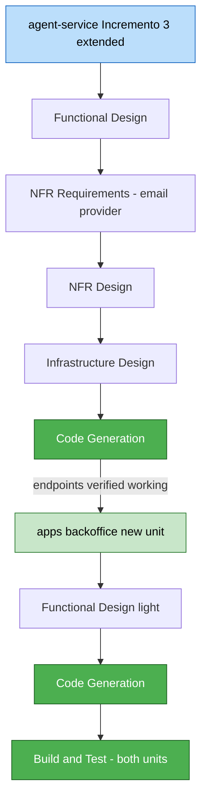

# Unit of Work Dependencies — BackOffice Lead Qualification View

**Date**: 2026-07-10

---

## Dependency Matrix

| Unit | Depends On | Nature of Dependency | Build Sequencing |
|---|---|---|---|
| `agent-service` (extended, Incremento 3) | Existing `agent-service` Incremento 1/2 code (`Lead`, `LeadRepository`, `ChatAgentClient`, BR-17/BR-17b) | Extends existing components in place | Already satisfied |
| `agent-service` (extended, Incremento 3) | Email provider decision (NFR Requirements, this unit's own Construction stage) | `EmailSender` adapter cannot be implemented until a provider is chosen | Internal to this unit's per-unit loop (NFR Requirements before Code Generation) |
| `apps/backoffice` (new) | `agent-service` (extended, Incremento 3) — `GET /leads`, `/ws/leads`, draft generate/send/discard endpoints | Contract dependency — `apps/backoffice` is a pure consumer, no shared code/database | **Strictly sequential (Q2 = A)**: `agent-service` fully built and its endpoints verified working before `apps/backoffice` Code Generation starts. Not built against a mock. |
| `apps/backoffice` (new) | `apps/chat` | None | Independent — confirmed at Requirements Analysis and re-confirmed in Application Design (`backoffice-component-dependency.md`) |

---

## Build Sequencing Rationale (Q2 = A)

`backoffice-execution-plan.md` already established this order: "Unit: agent-service (extended) — built first (dependency: apps/backoffice consumes its contract)" and "Unit: apps/backoffice (new) — built second, consuming agent-service's contract." This unit-of-work plan carries that decision forward rather than introducing a parallel/mock-based approach — chosen because:
- The contract surface is small enough (3-4 endpoints/channels) that mocking would add coordination overhead without a real speed benefit at this project's single-developer scale.
- `apps/chat`'s incremento 2 was built the same way (backend first, frontend integrated against the real running service) — consistent precedent.

---

## Sequencing Diagram



### Text Alternative

```
1. agent-service (Incremento 3): Functional Design -> NFR Requirements (email provider
   decision) -> NFR Design -> Infrastructure Design -> Code Generation
2. Gate: agent-service's endpoints (GET /leads, /ws/leads, draft actions) verified working
3. apps/backoffice (new unit): Functional Design (light) -> Code Generation
   (consumes the now-real agent-service contract, no mocking)
4. Build and Test: both units together, end-to-end
```

---

## Cross-Unit Communication Summary

No shared database, shared code, or shared deploy target between the two units — the only coupling is the HTTP/WebSocket contract documented in `backoffice-component-methods.md` and `backoffice-component-dependency.md`. This keeps the two units independently buildable/testable in the order established above, and independently deployable later (both currently local-only, per each unit's Infrastructure Design status).
