# Execution Plan — BackOffice Lead Qualification View

**Date**: 2026-07-09
**Based on**: `aidlc-docs/inception/requirements/backoffice-requirements.md`, `aidlc-docs/inception/user-stories/backoffice-{stories,personas}.md`

---

## Detailed Analysis Summary

### Transformation Scope (Brownfield)
- **Transformation Type**: New unit-of-work (`apps/backoffice`, a genuinely new deployable) plus a substantial extension to the existing `agent-service` unit (new domain concepts, not just new endpoints).
- **Primary Changes**:
  - `apps/backoffice`: new Next.js app — kanban board (Hot/Warm/Cold), lead detail popup, real-time updates, draft review/send UI, in-app notifications.
  - `services/agent-service`: new `list_leads` read path (`GET /leads`), new WebSocket broadcast channel for lead/score events, a new **outreach agent** capability (drafts personalized emails, triggered automatically on `hot` or on-demand), a new **draft lifecycle** (generate → review → send/discard — this is new persistent state, not something `Lead` already models), and an email-sending adapter.
- **Related Components**: One new unit (`apps/backoffice`) plus an extension of the existing `agent-service` unit. No changes to `apps/chat` — the two frontends are independent consumers of `agent-service`.

### Change Impact Assessment
- **User-facing changes**: Yes — an entirely new persona (DMC Sales Staff) gets a UI surface that didn't exist before.
- **Structural changes**: Yes — new frontend app; new backend components (read path, WS broadcaster, outreach agent, draft store, email adapter).
- **Data model changes**: Yes — need a place to persist outreach drafts (generated text, status: pending/sent/discarded, which lead, which trigger). This is new domain state, deferred to Functional Design for exact shape.
- **API changes**: Yes — `GET /leads`, a new `/ws/leads` (or similar) channel, plus endpoints/messages for on-demand draft generation and send/discard actions.
- **NFR impact**: Yes — new external-ish capability (outbound email) needs a provider decision (NFR-5, deferred from Requirements) and secret management; PII already flagged (NFR-1, issue #18 open); no new scalability concerns (demo-scale, per project's existing performance de-prioritization).

### Component Relationships
```
apps/backoffice (frontend, new unit)
    │  GET /leads (read)
    │  WS /ws/leads (live board updates, notifications)
    │  draft review/send/discard actions
    ▼
services/agent-service (existing unit, extended)
    │  uses: Postgres (existing) — new table(s) for outreach drafts
    │  uses: Azure OpenAI / Foundry Agent (existing) — new prompt/agent role for drafting
    │  new: email-sending adapter (provider TBD — NFR Requirements)
    ▼
Email provider (external, provider TBD)
```
`apps/chat` is unaffected — it doesn't consume or expose anything new from this work.

### Risk Assessment
- **Risk Level**: **Medium** — multiple new components, but additive (no changes to existing `apps/chat`/`Lead`-scoring behavior), no auth/production exposure yet (local/demo scope, per NFR-1), easy to roll back (git revert, no live traffic depends on this).
- **Rollback Complexity**: Easy — new app, new tables/endpoints, nothing existing is modified in a breaking way.
- **Testing Complexity**: Moderate — the outreach agent (LLM-drafted content) and real-time WS behavior both need the same discipline this project already applies (real infrastructure over mocks — see prior `build-and-test-summary.md` rounds), but the surface is smaller than agent-service incremento 2's tool-calling work.

---

## Workflow Visualization

```mermaid
flowchart TD
    Start(["User Request: BackOffice lead qualification view"])

    subgraph INCEPTION["Inception Phase"]
        WD["Workspace Detection<br/>COMPLETED"]
        RA["Requirements Analysis<br/>COMPLETED"]
        US["User Stories<br/>COMPLETED"]
        WP["Workflow Planning<br/>IN PROGRESS"]
        AD["Application Design<br/>EXECUTE"]
        UG["Units Generation<br/>EXECUTE"]
    end

    subgraph CONSTRUCTION["Construction Phase"]
        subgraph UNIT_AS["Unit: agent-service (extended)"]
            FD1["Functional Design<br/>EXECUTE"]
            NFRA1["NFR Requirements<br/>EXECUTE"]
            NFRD1["NFR Design<br/>EXECUTE"]
            ID1["Infrastructure Design<br/>EXECUTE"]
            CG1["Code Generation<br/>EXECUTE"]
        end
        subgraph UNIT_BO["Unit: apps/backoffice (new)"]
            FD2["Functional Design (light)<br/>EXECUTE"]
            CG2["Code Generation<br/>EXECUTE"]
        end
        BT["Build and Test<br/>EXECUTE"]
    end

    Start --> WD --> RA --> US --> WP --> AD --> UG
    UG --> FD1 --> NFRA1 --> NFRD1 --> ID1 --> CG1
    CG1 --> FD2 --> CG2
    CG2 --> BT --> End(["Complete"])

    style WD fill:#4CAF50,stroke:#1B5E20,stroke-width:3px,color:#fff
    style RA fill:#4CAF50,stroke:#1B5E20,stroke-width:3px,color:#fff
    style US fill:#4CAF50,stroke:#1B5E20,stroke-width:3px,color:#fff
    style WP fill:#4CAF50,stroke:#1B5E20,stroke-width:3px,color:#fff
    style AD fill:#FFA726,stroke:#E65100,stroke-width:3px,stroke-dasharray: 5 5,color:#000
    style UG fill:#FFA726,stroke:#E65100,stroke-width:3px,stroke-dasharray: 5 5,color:#000
    style FD1 fill:#FFA726,stroke:#E65100,stroke-width:3px,stroke-dasharray: 5 5,color:#000
    style NFRA1 fill:#FFA726,stroke:#E65100,stroke-width:3px,stroke-dasharray: 5 5,color:#000
    style NFRD1 fill:#FFA726,stroke:#E65100,stroke-width:3px,stroke-dasharray: 5 5,color:#000
    style ID1 fill:#FFA726,stroke:#E65100,stroke-width:3px,stroke-dasharray: 5 5,color:#000
    style CG1 fill:#4CAF50,stroke:#1B5E20,stroke-width:3px,color:#fff
    style FD2 fill:#FFA726,stroke:#E65100,stroke-width:3px,stroke-dasharray: 5 5,color:#000
    style CG2 fill:#4CAF50,stroke:#1B5E20,stroke-width:3px,color:#fff
    style BT fill:#4CAF50,stroke:#1B5E20,stroke-width:3px,color:#fff
    style Start fill:#CE93D8,stroke:#6A1B9A,stroke-width:3px,color:#000
    style End fill:#CE93D8,stroke:#6A1B9A,stroke-width:3px,color:#000

    linkStyle default stroke:#333,stroke-width:2px
```



---

## Phases to Execute

### Inception Phase
- [x] Workspace Detection — reused (existing project)
- [x] Requirements Analysis — COMPLETED and APPROVED (2026-07-09)
- [x] User Stories — COMPLETED and APPROVED (2026-07-09)
- [x] Workflow Planning — IN PROGRESS (this document)
- [ ] Application Design — **EXECUTE**
  - **Rationale**: New components/services need defining before code generation — most notably the outreach agent (its responsibilities, how it relates to the existing `ChatAgentClient`/Foundry Agent setup) and the draft lifecycle's data ownership. This isn't a trivial extension of existing component boundaries the way `frontend-integration-execution-plan.md` judged incremento 2 to be (that stayed within existing components; this introduces a new one).
- [ ] Units Generation — **EXECUTE**
  - **Rationale**: Two distinct units are involved — the existing `agent-service` unit (extended) and a genuinely new unit, `apps/backoffice`, that doesn't yet exist in `unit-of-work.md`. Needs formal registration the same way `apps/chat` was formalized in `frontend-integration-execution-plan.md`.

### Construction Phase

**Unit: agent-service (extended) — built first (dependency: apps/backoffice consumes its contract)**
- [ ] Functional Design — **EXECUTE**
  - **Rationale**: New business logic — outreach agent drafting behavior, draft lifecycle/state machine (generate → pending → sent/discarded), `list_leads` read model, WS broadcast message schema.
- [ ] NFR Requirements — **EXECUTE**
  - **Rationale**: Email provider selection is explicitly deferred here (NFR-5). Security: new PII exposure surface even without auth (NFR-1/issue #18 already open), plus a new outbound-communication risk (what stops runaway/duplicate sends — partially answered by FR-12's human gate, but rate-limiting/idempotency still needs a decision).
- [ ] NFR Design — **EXECUTE**
  - **Rationale**: Patterns needed for WS broadcast fan-out, draft persistence/idempotency (Story 4's "no duplicate draft" requirement), and email send confirmation/retry.
- [ ] Infrastructure Design — **EXECUTE**
  - **Rationale**: New secret (email provider API key) needs a Key Vault entry, same pattern as Mercado Pago's secret in incremento 2; new Postgres migration for the drafts table. No new compute resources expected (extends the existing Container App), and — consistent with the rest of this project — no `terraform apply` is implied until the user decides to deploy.
- [ ] Code Generation — **EXECUTE (ALWAYS)**

**Unit: apps/backoffice (new) — built second, consuming agent-service's contract**
- [ ] Functional Design — **EXECUTE (light)**
  - **Rationale**: Same treatment `apps/chat` got in incremento 2 — new UI components with real interaction logic (kanban drag-free column rendering, popup state, draft review/send flow, WS-driven live updates, toast notifications) need their component/state structure defined, but no new backend-style business logic lives here.
- [ ] NFR Requirements — **SKIP**
  - **Rationale**: No new NFRs beyond what's already decided (no auth per NFR-1, demo-scale performance per NFR-4) — same reasoning `apps/chat` used in incremento 2.
- [ ] NFR Design — **SKIP** (consequence of NFR Requirements skip)
- [ ] Infrastructure Design — **SKIP**
  - **Rationale**: `next dev` locally, same as `apps/chat` — no deployment infra decided for either frontend yet.
- [ ] Code Generation — **EXECUTE (ALWAYS)**
  - **Note**: This is where the `frontend-design` skill is invoked (NFR-2 — distinct visual identity aligned to dmc.pe brand guidelines).

- [ ] Build and Test — **EXECUTE (ALWAYS)**
  - **Rationale**: End-to-end verification of the full flow — board loads real leads, live score change moves a card, hot lead triggers an auto-draft, staff reviews and sends it, in-app notification fires — following this project's established pattern of testing against real infrastructure (real Postgres, real WS connections, real LLM calls) rather than mocks wherever feasible.

### Operations Phase
- [ ] Operations — PLACEHOLDER

---

## Estimated Timeline
- **Total stages to execute**: 10 (Application Design ×1, Units Generation ×1, Functional Design ×2, NFR Requirements ×1, NFR Design ×1, Infrastructure Design ×1, Code Generation ×2, Build and Test ×1)
- **Estimated Duration**: Comparable to agent-service incremento 2, though narrower in scope (no payment integration, no multi-turn tool-calling protocol changes) — the main open unknown is the email provider decision (NFR Requirements) and whether credentials will be available to test against (mirrors the Mercado Pago precedent — build-but-possibly-untested is an acceptable outcome per this project's established pattern).

## Success Criteria
- **Primary Goal**: DMC staff can open `apps/backoffice`, see all leads grouped Hot/Warm/Cold updating live, open any lead's detail, and — when a lead goes hot (or on-demand) — review an AI-drafted personalized email and explicitly send it, with an in-app notification surfacing the moment it mattered.
- **Key Deliverables**: `GET /leads` + `/ws/leads` on `agent-service`; outreach agent + draft persistence + email adapter; `apps/backoffice` kanban board, detail popup, draft review/send UI, notifications — styled per DMC brand guidelines (dmc.pe).
- **Quality Gates**: Test suite green for both the `agent-service` extension and `apps/backoffice`; manual end-to-end verification of the full flow (board → detail → auto-draft-on-hot → review → send → notification), consistent with how incremento 1 and incremento 2 were verified.
- **Integration Testing**: Full flow verified locally, frontend ↔ backend ↔ (email provider, if credentials are available).
