# Execution Plan — DMC Sales Agent

**Versión**: 1.0  
**Fecha**: 2026-04-28  
**Tipo de proyecto**: Greenfield

---

## Detailed Analysis Summary

### Change Impact Assessment

| Área | Impacto | Descripción |
|---|---|---|
| User-facing changes | **Sí** | Chat widget completo + backoffice portal — dos superficies nuevas desde cero |
| Structural changes | **Sí** | Arquitectura multi-servicio: Lambda WebSocket, AgentCore Runtime, Bedrock, Vector DB, DynamoDB x2, SES, S3, Cognito |
| Data model changes | **Sí** | Dos tablas DynamoDB nuevas (dmc-leads, dmc-conversations) + esquema vectorial en knowledge base |
| API changes | **Sí** | API Gateway WebSocket nuevo + REST endpoints para backoffice |
| NFR impact | **Sí** | Performance (≤3s primer token), seguridad (Cognito JWT, CORS, Secrets), PBT enforcement (Hypothesis) |

### Risk Assessment

| Factor | Nivel | Detalle |
|---|---|---|
| **Risk Level** | **HIGH** | Múltiples servicios AWS nuevos, tecnología Strands SDK / AgentCore Runtime relativamente nueva, WebSocket en Lambda requiere patrones específicos |
| **Rollback Complexity** | Moderada | Servicios stateless (Lambda, AgentCore) son fáciles de revertir; DynamoDB y Vector DB requieren plan de migración |
| **Testing Complexity** | Alta | Evals del agente, RAG quality tests, guardrail tests, PBT con Hypothesis, integración de 5 unidades |

---

## Workflow Visualization

```mermaid
flowchart TD
    Start(["Solicitud del Usuario"])

    subgraph INCEPTION["🔵 INCEPTION PHASE"]
        WD["Workspace Detection\n✅ COMPLETADO"]
        RE["Reverse Engineering\n⏭️ SKIP — Greenfield"]
        RA["Requirements Analysis\n✅ COMPLETADO"]
        US["User Stories\n✅ COMPLETADO"]
        WP["Workflow Planning\n🔄 EN CURSO"]
        AD["Application Design\n▶️ EJECUTAR"]
        UG["Units Generation\n▶️ EJECUTAR"]
    end

    subgraph CONSTRUCTION["🟢 CONSTRUCTION PHASE"]
        FD["Functional Design\n▶️ EJECUTAR — por unidad"]
        NFRR["NFR Requirements\n▶️ EJECUTAR — por unidad"]
        NFRD["NFR Design\n▶️ EJECUTAR — por unidad"]
        ID["Infrastructure Design\n▶️ EJECUTAR — por unidad"]
        CG["Code Generation\n▶️ EJECUTAR — siempre"]
        BT["Build and Test\n▶️ EJECUTAR — siempre"]
    end

    subgraph OPERATIONS["🟡 OPERATIONS PHASE"]
        OPS["Operations\n⏸️ PLACEHOLDER"]
    end

    Start --> WD
    WD --> RE
    RE --> RA
    RA --> US
    US --> WP
    WP --> AD
    AD --> UG
    UG --> FD
    FD --> NFRR
    NFRR --> NFRD
    NFRD --> ID
    ID --> CG
    CG --> BT
    BT --> OPS
    OPS --> End(["Completo"])

    style Start fill:#CE93D8,stroke:#6A1B9A,stroke-width:3px,color:#000
    style End fill:#CE93D8,stroke:#6A1B9A,stroke-width:3px,color:#000
    style WD fill:#4CAF50,stroke:#1B5E20,stroke-width:3px,color:#fff
    style RA fill:#4CAF50,stroke:#1B5E20,stroke-width:3px,color:#fff
    style US fill:#4CAF50,stroke:#1B5E20,stroke-width:3px,color:#fff
    style WP fill:#4CAF50,stroke:#1B5E20,stroke-width:3px,color:#fff
    style RE fill:#BDBDBD,stroke:#424242,stroke-width:2px,stroke-dasharray: 5 5,color:#000
    style AD fill:#FFA726,stroke:#E65100,stroke-width:3px,stroke-dasharray: 5 5,color:#000
    style UG fill:#FFA726,stroke:#E65100,stroke-width:3px,stroke-dasharray: 5 5,color:#000
    style FD fill:#FFA726,stroke:#E65100,stroke-width:3px,stroke-dasharray: 5 5,color:#000
    style NFRR fill:#FFA726,stroke:#E65100,stroke-width:3px,stroke-dasharray: 5 5,color:#000
    style NFRD fill:#FFA726,stroke:#E65100,stroke-width:3px,stroke-dasharray: 5 5,color:#000
    style ID fill:#FFA726,stroke:#E65100,stroke-width:3px,stroke-dasharray: 5 5,color:#000
    style CG fill:#FFA726,stroke:#E65100,stroke-width:3px,stroke-dasharray: 5 5,color:#000
    style BT fill:#FFA726,stroke:#E65100,stroke-width:3px,stroke-dasharray: 5 5,color:#000
    style OPS fill:#BDBDBD,stroke:#424242,stroke-width:2px,stroke-dasharray: 5 5,color:#000
    linkStyle default stroke:#333,stroke-width:2px
```

---

## Phases to Execute

### 🔵 INCEPTION PHASE

- [x] Workspace Detection — COMPLETADO (2026-04-23)
- [x] Reverse Engineering — SKIP (greenfield, sin código existente)
- [x] Requirements Analysis — COMPLETADO y APROBADO (2026-04-28)
- [x] User Stories — COMPLETADO y APROBADO (2026-04-28)
- [x] Workflow Planning — EN CURSO
- [ ] Application Design — **EJECUTAR**
  - **Rationale**: Sistema greenfield con múltiples componentes nuevos: Strands Agent con 4 tools, capa LLMProvider agnóstica, FastAPI Lambda handler, ingestion pipeline, widget Next.js, backoffice Next.js. Interfaces entre componentes y reglas de negocio del agente requieren diseño explícito antes de implementar.
- [ ] Units Generation — **EJECUTAR**
  - **Rationale**: El sistema tiene 5 unidades técnicamente independientes con dependencias secuenciales claras. Descomposición necesaria para Construction phase.

### 🟢 CONSTRUCTION PHASE — por cada unidad

- [ ] Functional Design — **EJECUTAR**
  - **Rationale**: Modelos de datos nuevos (dmc-leads, dmc-conversations, vector DB schema), lógica de negocio compleja (funnel state machine, lead scoring, detección de motivación), tools del agente con contratos explícitos.
- [ ] NFR Requirements — **EJECUTAR**
  - **Rationale**: Requisitos de performance (≤3s primer token via streaming), seguridad bloqueante (extensión SECURITY habilitada), PBT con Hypothesis (extensión PBT habilitada). Vector DB technology decision pendiente.
- [ ] NFR Design — **EJECUTAR**
  - **Rationale**: NFR Requirements se ejecuta; patrones de diseño para LLMProvider, WebSocket reconnect, structured logging, presigned URLs.
- [ ] Infrastructure Design — **EJECUTAR**
  - **Rationale**: Múltiples servicios AWS nuevos (Lambda + API Gateway WebSocket, DynamoDB x2, S3, Cognito, AgentCore Runtime, Bedrock, SES, Vector DB TBD). Especificación de IAM roles, VPC, variables de entorno, y deployment patterns.
- [ ] Code Generation — **EJECUTAR** (siempre)
- [ ] Build and Test — **EJECUTAR** (siempre)

### 🟡 OPERATIONS PHASE

- [ ] Operations — PLACEHOLDER (future expansion)

---

## Units Breakdown

Las 5 unidades serán generadas en la etapa Units Generation. Se ejecutan secuencialmente en este orden:

| # | Unidad | Descripción | Dependencia |
|---|---|---|---|
| 1 | **ingestion-pipeline** | Script Python: S3 → Bedrock Claude (LLMProvider) → embeddings → Vector DB | Ninguna |
| 2 | **strands-agent** | Strands Agent con tools (search_courses, qualify_lead, generate_payment_link, get_brochure_url), LLMProvider interface, AgentCore deployment | Vector DB poblado por unidad 1 |
| 3 | **backend-api** | FastAPI en Lambda + API Gateway WebSocket + DynamoDB x2 + SES + Mercado Pago | Agent desplegado en AgentCore (unidad 2) |
| 4 | **frontend-widget** | Next.js chat widget + WebSocket client + localStorage + streaming UI | Backend API disponible (unidad 3) |
| 5 | **frontend-backoffice** | Next.js /admin + Cognito auth + lista/detalle leads + escalation view | Backend API disponible (unidad 3) |

---

## Success Criteria

| Criterio | Métrica |
|---|---|
| Happy path completo | Agente llega al cierre sin errores |
| Motivación detectada | ≥85% correcta en conversaciones de prueba |
| Score correcto | Hot cuando pidió link; Cold cuando solo exploró |
| Primer token | ≤3 segundos via WebSocket streaming |
| Guardrails activos | Agente no inventa precios; no menciona competidores; no sale del scope |
| Lead en DynamoDB | Todos los campos correctos tras conversación |
| Backoffice | Lista y detalle visibles tras login con Cognito |
| PBT coverage | Lógica de scoring y motivación cubierta con Hypothesis |
